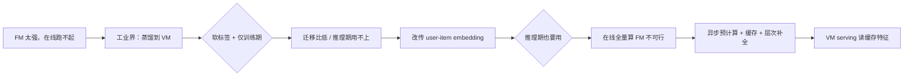

# SOLARIS: 面向推理扩展的潜表示推测式卸载

论文链接：https://arxiv.org/abs/2604.12110  
发表会议：SIGIR 2026 Industry Track  
作者单位：Meta AI  

---

## 一、研究动机与问题定义

推荐系统 Scaling Laws 推动基础模型（Foundation Model, FM）规模与能力持续增长，在离线评测上带来稳定收益。但 FM 的计算开销使**实时在线 serving** 难以承受，工业界普遍采用**知识蒸馏**将 FM 能力迁移到轻量垂直模型（Vertical Model, VM），在效率与效果之间折中。

传统软标签蒸馏存在两大瓶颈：

1. **迁移比例低、泛化受限**：软标签蒸馏在排序场景中的知识迁移比例通常仅 20%–25%，且预测分布与具体任务强绑定。
2. **仅在训练期迁移**：知识共享发生在有标签的训练阶段，**推理阶段无法利用 FM 的表示能力**。

论文提出 **SOLARIS**（**S**peculative **O**ffloading of **L**atent-b**A**sed **R**epresentation for **I**nference **S**caling），受 LLM **推测解码（speculative decoding）** 启发：提前预测未来请求中可能出现的 user-item 对，在后台异步预计算 FM 的交互嵌入，将昂贵 FM 推理从延迟敏感的在线路径中解耦。

---

## 二、系统背景

### 2.1 多阶段排序流水线

现代推荐/广告系统通常包含：

1. **召回（Retrieval）**：粗筛候选。
2. **早期排序（Early-stage ranking）**：轻量深度模型，将候选缩至数百量级。
3. **最终排序（Final-stage ranking）**：高算力、多信号融合，决定拍卖与投放。

SOLARIS 作用于 **最终排序阶段的 VM**。

### 2.2 知识迁移范式对比

| 范式 | 机制 | 局限 |
|------|------|------|
| 知识蒸馏 | 软标签概率分布 | 信息带宽有限，迁移比 ~25% |
| Embedding 共享 | 上游表示作为下游特征 | 在线全量计算成本高 |

SOLARIS 结合二者优势：**直接迁移 user-item 交互嵌入**，并在**推理期**通过缓存供给 VM。

---

## 三、核心方法

### 3.1 三大创新

1. **基于嵌入的直接迁移**：从 FM 最后一层共享交互层提取 user-item 嵌入，经自编码器压缩为固定维向量，作为 VM 额外输入特征；相比软标签承载更丰富的交互模式。
2. **推测式嵌入预计算**：后台服务根据入站请求中的候选 item，对高相关 user-item 对异步计算 FM 嵌入并写入分布式缓存。
3. **层次化特征增强（Hierarchical Feature Enrichment）**：缓存未命中时，用聚合用户表示与相似用户 imputation 提升覆盖率，避免线性蒸馏成本。

### 3.2 FM 兼容性与特征提取

- 适用于多任务、多标签（MTML）风格的 FM：稠密路径、稀疏 embedding bag、变长行为序列等异构特征经共享交互栈（如 WHEN/DCN/LCE 等）融合。
- **提取位置**：共享特征交互网络的输出（最后一层共享层），被认为最集中 user-item 交互知识。
- **压缩**：Autoencoder 将高维嵌入压到 VM 可消费的固定维度。
- **在线 FM 训练**持续进行，以适配分布漂移；嵌入与常规特征一样被 VM 在 serving 时读取。

### 3.3 异步预计算（Asynchronous Precompute）

**问题**：对用户池 × 物品池全量在线计算 FM 嵌入在算力与存储上不可行。

**流程概要**：

1. 用户请求经多阶段漏斗后，候选 item 规模降至数百级。
2. 后台任务对其中 **Verifier 模型判定为最相关的前 20%** user-item 对计算 FM 嵌入。
3. 结果写入分布式缓存，键为 `<user, item>`。

**Verifier 机制**：用当前 VM 的预测分作为轻量过滤器，只保留高相关对进入预计算——与推测解码中“先猜哪些 token/对会被需要”同构。

**TTL 失效**：用户短期兴趣相对稳定；早期排序中约 **60%+** 候选曾在过去 6 小时内出现过。缓存读取 TTL 通常为**数小时**，在新鲜度与成本间折中。

**Serving 行为**：VM 查询缓存；缺失或过期则排队等待下一轮刷新，VM 输入侧用 **零张量占位**，不阻塞主路径延迟预算。

### 3.4 层次化特征增强（Coverage）

裸异步预计算在系统中约 **50%** user-item 覆盖率（生产训练数据上统计约 **40%**）。两层补充策略：

#### （1）聚合 user-item 嵌入（User-only / Aggregated）

- 对同一用户过去 24h 内**除当前 item 外**的所有可用 user-item 嵌入取平均，得到 user 级聚合表示。
- 假设短期偏好一致，将覆盖率提升至约 **85%–90%**。
- 生产部署为独立特征；在 Instagram CTR 等任务上额外带来约 **0.03%** BCE 下降，已 rollout 至 10+ 下游模型。

#### （2）基于相似度的嵌入（Similarity-based）

- 专用 FM 生成用户嵌入 → **KNN**（余弦相似度）建用户聚类/近邻表。
- 对缺失 `<user, item>`：在相似用户中查找已有 `<neighbor, item>` 嵌入，采用距离加权平均或**最近邻单点**策略 impute。
- 覆盖率从 40% 提升至约 **70%**，相对纯覆盖率实验的“上限空间”约兑现 **40%**（质量低于真实预计算嵌入）。

---

## 四、实验与生产结果

**场景**：Meta 全球广告系统，数十亿日请求；基线为未接入 SOLARIS 的各垂直独立模型组合。

**评测指标**：CTR/CVR 的 BCE（Binary Cross-Entropy）相对下降、迁移比例（Transfer Ratio）、特征覆盖率、收入类 top-line 指标。

### 4.1 垂直模型性能（Table: vertical）

| 任务 | 子任务 | BCE 相对下降 |
|------|--------|-------------|
| CTR | Facebook Feed | 0.09% |
| CTR | Facebook Reels | 0.08% |
| CTR | Instagram | 0.05% |
| CTR | Instagram Link Click | 0.05% |
| CVR | Facebook Feed + Reels | 0.10% |
| CVR | Offsite Conversion | 0.05% |

### 4.2 迁移比例

- Instagram：**42%**
- Facebook：**44%**
- 约为传统蒸馏方案的 **约 2×**

### 4.3 覆盖率与收益

| 机制 | 覆盖率 / 效果 |
|------|----------------|
| 异步预计算（生产） | ~40%；覆盖率 +30% → BCE 再降 0.05%（离线 down-sample 实验） |
| 聚合 user 嵌入 | ~90%；+0.03% BCE；收入 +0.07% |
| KNN 相似用户 impute | 40%→70%；+0.02% BCE（约为覆盖率 headroom 的 40%） |

### 4.4 整体业务影响

- **10+** 生产模型相对 log loss（RLL）最高约 **0.2%** 提升。
- 覆盖率提升约 **30%**。
- 全球广告 **收入驱动 top-line 指标 +0.67%**（论文表述为数十亿美元量级潜在影响）。

---

## 五、讨论与局限

1. **覆盖率仍有空间**：当前 U2U 聚类 impute 收益有限；计划探索 **A2A（ad-to-ad）** 与混合策略。
2. **阶段限制**：目前仅最终排序 VM 受益；早期排序候选规模为最终阶段的约 **100×**，算力与覆盖率约束更大，仍在推进。
3. **可泛化性**：部分结论依赖 Meta 广告业务形态、伙伴约束与公司特定基础设施，读者需结合自有场景评估。

---

## 六、要点总结

| 维度 | 内容 |
|------|------|
| 问题 | 大 FM 效果好但无法在线全量推理；软标签蒸馏迁移比低且仅限训练期 |
| 思路 | 推测式预计算 user-item FM 嵌入 + 缓存供 VM 推理期使用 |
| 关键技术 | 共享层嵌入 + AE 压缩；Verifier 筛选 Top 20%；TTL 缓存；聚合用户嵌入 + KNN impute |
| 效果 | 迁移比 ~2× 蒸馏；多任务 BCE 一致下降；生产收入 +0.67% |
| 与生成式推荐关系 | 属于 **大模型/基础模型表示 → 在线排序 VM** 的推理期知识扩展，与“生成式”检索/排序中的 FM scaling 与 serving 工程强相关 |

---

## 七、关键引用与相关工作（论文内）

- 推测解码：Leviathan et al., speculative decoding for fast LLM inference。
- FM / 扩展架构：Meta Lattice、Wukong scaling law、External large foundation model 等。
- 蒸馏与排序：Hinton distillation、Tang ranking distillation 等。
- Embedding 共享：Deep & Cross、Pupil network 等工业实践。

---

## 八、延伸讨论记录

> 本节记录阅读论文后的问答讨论，保留提问原文与回复全文，便于后续复习概念衔接与工程落地逻辑。

---

### 讨论 1：Motivation（蒸馏）与 pre-computing user-item representation 的关系

#### 提问

> 本文的 motivation 是工业界采用 distillation 把 FM 模型的能力转移到 vertical model 上，但这个和提前计算 user-item representation 有什么关系呢？

#### 回复（全文）

可以把关系理解成：**蒸馏解决的是「要不要、怎么把 FM 知识给 VM」；预计算解决的是「在推理期、在线路径上，这种知识怎么给得起」**。二者不是并列的两件事，而是「动机 → 瓶颈 → 手段」的一条链。

##### 1. Motivation 真正在批评什么

工业界用蒸馏，目标很明确：**大 FM 不能在线全量跑，但希望 VM 在 serving 时也能用到 FM 的能力**。

论文认为传统蒸馏有两处硬伤：

| 痛点 | 含义 |
|------|------|
| 软标签带宽有限 | 只传概率分布，排序场景迁移比约 20%–25% |
| 主要在训练期迁移 | 有 label 时 teacher 指导 student；**推理时 VM 通常拿不到 FM 的实时、细粒度交互表示** |

所以 motivation 不只是「要蒸馏」，而是：**要在推理阶段、以更高保真度，把 FM 对 user-item 的交互知识交给 VM**。

##### 2. 为什么转向 user-item representation

论文的替代路线是：**不蒸馏软标签，直接传 FM 共享层上的 user-item 交互 embedding**（再经 AE 压成固定维，作为 VM 的额外特征）。

这和蒸馏在目标上一致（FM → VM），在载体上不同：

- 蒸馏：传「这个 pair 的预测分布」
- SOLARIS：传「这个 pair 在 FM 里的交互表示」

实验里迁移比从约 25% 提到 42%–44%，说明他们把这看成**更强的知识传递形式**，而不是和蒸馏无关的另一条线。

##### 3. 预计算和 motivation 的衔接点

若只在**训练**时离线算一遍 embedding 给 VM，那和常见的 embedding sharing 更接近，**还不足以单独构成 SOLARIS 的核心故事**。

真正卡住工业部署的是：

> 若在 **每次在线排序** 里，对每个候选 (user, item) 都现场跑一遍 FM 算 embedding → 延迟和算力不可接受。

于是出现逻辑跳跃的「桥」：

```text
目标：推理期也要用 FM 的 user-item 知识（而不只是训练期蒸馏）
手段：不能直接在线算 FM
     → 提前/async 算好「很可能会出现在本次请求里的」pair 的 embedding
     → 缓存在线读取，VM 当普通特征用
```

这和 LLM **推测解码** 的类比是：

- 推测解码：先猜哪些 token 会被用到，提前算 draft
- SOLARIS：用 Verifier（当前 VM 分）猜哪些 user-item 对重要，**提前算 Top 20% 的 FM 嵌入**

所以 **precompute 不是 motivation 的替代品，而是让「推理期 embedding 迁移」在百亿级请求下可落地的工程前提**。

##### 4. 一张逻辑图



##### 5. 和「纯蒸馏」相比，多出来的那一层

| 维度 | 传统蒸馏 | SOLARIS |
|------|----------|---------|
| 传什么 | 软标签 | user-item embedding |
| 何时传 | 主要在训练 | **训练 + 推理（经缓存）** |
| 推理期 FM 在哪 | 通常不在线路上 | **在后台异步算，结果以特征形式进 VM** |
| 未命中怎么办 | — | 零向量 + 聚合 user 嵌入 + KNN 邻居 impute |

因此：**motivation 来自「蒸馏式 FM→VM 知识迁移在工业里不够好」；precompute 来自「若改用 embedding 并在推理期使用，就必须把 FM 推理移出延迟敏感路径」**。没有预计算，embedding 迁移很难在 final-stage ranking 的延迟预算里规模化；没有 embedding 迁移的动机，预计算就退化成普通离线特征工程，论文也不会强调相对蒸馏 2× 迁移比和推理期知识共享。

若你还想再抠一层：论文里 **训练期** 也会用这些嵌入（离线可近 100% 覆盖），**生产 serving** 才严重依赖 async precompute（约 40% 覆盖）——所以「和蒸馏的关系」在训练侧是**同一条知识迁移链路的升级版**，在 serving 侧才是 **precompute 成为必要条件**。

---

### 讨论 2：FM 上 pre-compute 的表示，如何保证在 VM 上也有较好效果？

#### 提问

> pre-computing user-item representation 是在 FM 上产生的，如何保证在 VM 上也有较好效果呢？

#### 回复（全文）

论文**没有**给出「FM 嵌入在 VM 上必然有效」的理论保证，靠的是一套**训练—Serving 对齐 + 任务监督 + 工程筛选**，让 VM **学会怎么用** FM 表示，而不是指望 VM 自己复现 FM。

##### 1. 机制：不是把 FM 搬进 VM，而是当「额外特征」

SOLARIS 里 FM 产出的是 **user-item 交互 embedding**，经自编码器压成固定维后，和 VM 原有的用户/广告/上下文特征 **拼在一起** 进 VM。

因此 VM 不需要在线跑 FM，只需要学：

> 在「自己的特征 + FM 的 pair 表示」下，怎么预测 CTR/CVR。

这和「用预训练 embedding 做下游」同一逻辑：**有效性来自 VM 在业务 loss 上学习如何利用这些特征**，不是 FM 与 VM 结构一致。

##### 2. 训练期对齐：VM 见过这些特征，且和线上一致

论文明确：

- 嵌入在 **训练、推理** 都会作为 VM 输入（与常规特征一样消费）；
- FM 侧还有 **在线训练**，缓解分布漂移；
- 离线实验里用同一套 SOLARIS 模型生成 embedding，可做近 **100%** 覆盖率做消融；生产 serving 才受 async 预计算限制（约 40%）。

也就是说：**保证效果的第一道关是「VM 在训练里已经学过在有/无 FM 特征时怎么预测」**。  
缓存未命中时用 **零张量占位**，说明 VM 也被训练成能处理「没有 FM 信号」的样本，避免 serving 硬依赖缓存。

##### 3. 任务监督：好不好由 VM 自己的 BCE/收入验证

论文没有用「FM–VM 表示相似度」当主指标，而是用 **各垂直模型在真实流量上的 BCE 下降** 和 **收入**：

- 多 surface 的 CTR/CVR：BCE 降 0.05%–0.10%（在 Meta 规模下已算显著）；
- 迁移比 42%–44%（相对软标签蒸馏约 2×）；
- 10+ 模型、全球 top-line 约 +0.67%。

这是工业论文里实际的「保证」：**在 VM 的目标函数和线上指标上有效**，而不是 embedding 空间可对齐。

##### 4. 预计算策略：尽量预计算「VM 会在乎」的 pair

Async 预计算不是随机扫全空间，而是：

1. 请求经多阶段漏斗后，候选已是 **数百级**；
2. **Verifier** 用 **当前 VM 的预测分** 筛 **Top 20%** 的 user-item 对再算 FM 嵌入。

这样缓存里的 pair 与 **VM 最终要打分、要竞价的对象** 更一致，减少「FM 算了很多 VM 根本不会用到的表示」的浪费，也提高 **特征对 VM 的边际效用**。

注意：Verifier 是 VM 的**当前版本**；VM 迭代后，预计算策略会跟着变，这是一种隐式 **FM 信号 ↔ VM 决策边界** 的对齐。

##### 5. 覆盖率与质量：补全策略也是为 VM 服务的

即使预计算只有约 40% 命中，论文还用两层 **给 VM 仍能用的 FM 衍生特征**：

| 策略 | 作用 |
|------|------|
| 24h 内 user 历史 pair 嵌入平均 | user 级聚合特征，覆盖率到 ~90%，单独还有 BCE/收入收益 |
| KNN 相似用户的 `<neighbor, item>` 嵌入 | 把覆盖率从 40% 拉到 ~70%，质量低于真预计算，但仍有增益 |

离线还做了 **覆盖率 vs BCE** 的 down-sample 实验：覆盖率 +30% → BCE 再降 0.05%，说明 **对 VM 而言，多一块 FM 信号通常仍有用**，只是 impute 的边际不如真实 pair 嵌入。

##### 6. 为何 FM 表示「可能」适合 VM（设计直觉，非定理）

1. **同源任务**：FM 也是为广告 CTR/CVR 等多任务训练的，共享层 user-item 嵌入编码的是 **交互模式**，与 VM 要优化的对象同族。  
2. **信息更丰富**：比软标签多一维连续表示，实验里迁移比更高。  
3. **VM 仍保留自主权**：VM 有自己的塔、校准、多任务头；FM 特征只是 **增量信息**，差的时候可以学低权重（训练会体现）。  
4. **压缩**：AE 把 FM 嵌入压到 VM 侧固定维度，减轻维度/分布不匹配。

##### 7. 仍存在的风险（论文也承认）

- **缓存未命中 / 过期**：零向量或弱 impute，信号弱于真实 pair 嵌入。  
- **新鲜度**：异步 + TTL（数小时），用户兴趣突变时 FM 嵌入可能滞后。  
- **VM 大改版**：需重新训练 VM 与 Verifier/缓存策略的配合。  
- **早期排序**：候选规模大，尚未 rollout，VM 收益主要在 final stage。

这些说明：**效果不是「FM 嵌入天生可迁移」的保证，而是「VM 监督学习 + 预计算与 VM 决策对齐 + 覆盖补全」共同堆出来的**。

**一句话**：预计算解决的是 **算得起、送得到**；VM 上效果好，靠的是 **训练时把 FM 嵌入当特征联合拟合 CTR/CVR、推理时同 schema 读取、Verifier 对准高价值 pair，再用实验与收入验证**——论文用 BCE/迁移比/收入回答「好不好」，而不是形式化证明「一定好」。
